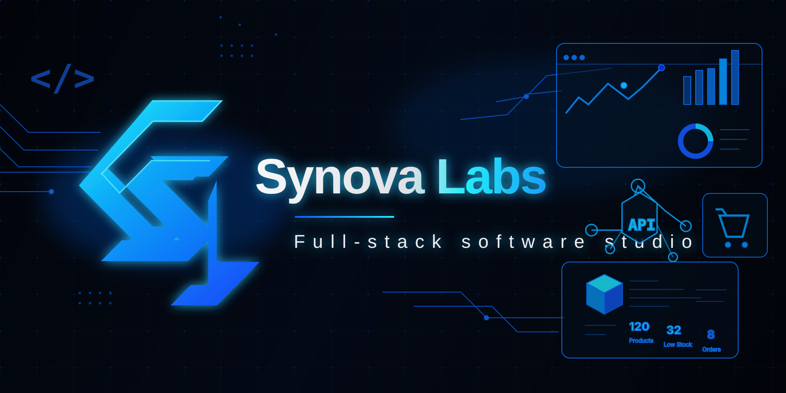



  

  

    
    
    
  

  

    
  

---

<table>
<tr>
<td width="58%" valign="top">

## Studio Snapshot

**Synova Labs** is a full-stack development studio based in **Bordj Bou Arreridj, Algeria**.

We build practical digital products for small businesses and modern teams: storefronts, admin dashboards, offline desktop tools, SaaS MVPs, APIs, and polished live demos.

Our style is direct: understand the business, design the workflow, build the product, test the flows, document the handoff, and make it demo-ready.

</td>
<td width="42%" valign="top">

## Focus Areas

- SaaS MVPs and product dashboards
- E-commerce storefronts and admin panels
- Inventory, sales, and internal business tools
- REST APIs, auth, databases, and integrations
- GitHub Pages demos and release-ready docs
- Desktop apps with local-first/offline storage

</td>
</tr>
</table>

---

## Featured Products

<table>
<tr>
<td width="33%" valign="top">

### StockPulse

**Offline inventory and sales desktop MVP** for small businesses.

- Products, stock, purchases, sales
- Reports, alerts, audit trail
- Electron + TypeScript + SQLite

[Live Demo](https://labssynova-coder.github.io/stockpulse/) · [Repo](https://github.com/labssynova-coder/stockpulse) · [Installer](https://github.com/labssynova-coder/stockpulse/releases/tag/v1.0.0)

</td>
<td width="33%" valign="top">

### LJS — Luxury Jewelry Shop

**Modern Django e-commerce platform** with storefront and admin experience.

- Catalog, cart, wishlist, checkout
- Blog and policy pages
- Jazzmin admin + 62 tests

[Storefront](https://labssynova-coder.github.io/LJS/) · [Admin](https://labssynova-coder.github.io/LJS/admin/) · [Repo](https://github.com/labssynova-coder/LJS)

</td>
<td width="33%" valign="top">

### BENSHOP Chaussettes

**Multilingual e-commerce system** for SARL BENSHOP Chaussettes.

- Storefront, cart, orders
- Admin dashboard
- WhatsApp ordering flow

[Storefront](https://labssynova-coder.github.io/benshop/) · [Admin](https://labssynova-coder.github.io/benshop/admin/) · [Repo](https://github.com/labssynova-coder/benshop)

</td>
</tr>
</table>

---

## Tech We Use

---

## What Makes Our Work Different

<table>
<tr>
<td width="50%" valign="top">

### Product Thinking

We do not just code screens. We shape flows around the business questions users actually care about: sales, profit, stock, customers, orders, and daily operations.

</td>
<td width="50%" valign="top">

### Demo-Ready Delivery

Projects are prepared to be shown: live demos, admin previews, release installers, clear README files, screenshots, and practical testing notes.

</td>
</tr>
<tr>
<td width="50%" valign="top">

### Full-Stack Ownership

Frontend, backend, database, deployment, documentation, and QA are treated as one connected product, not disconnected tasks.

</td>
<td width="50%" valign="top">

### Small-Business UX

We build tools that feel simple for non-technical users while still giving owners useful control, visibility, and confidence.

</td>
</tr>
</table>

---

## GitHub Activity

  

  

---

## Connect

**Have a SaaS idea, e-commerce project, dashboard, or internal business tool to build?**

[Website](https://www.synovalabs.tech) · [GitHub Projects](https://github.com/labssynova-coder?tab=repositories) · [Live Portfolio](https://www.synovalabs.tech)

